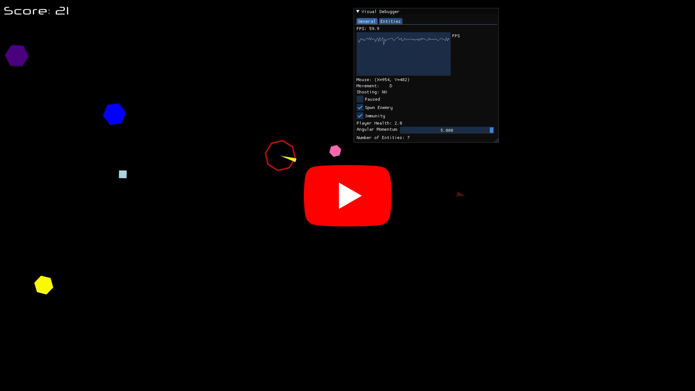

# Qosmit2D

Qosmit2D is amy simple 2D game engine in C++ and SFML built with Entity-Component-System (ECS) design in mind. I will be using this engine to build my games in the future. 

Here is a simple demo:

---

> [!TIP]
> The word Qosmit (قزمیت) (pronounced /qʊzˈmiːt/) has roots in the Farsi/Turkish languages and is colloquially used to refer to something (or someone) that is useless due to being decrepit or clunky.

